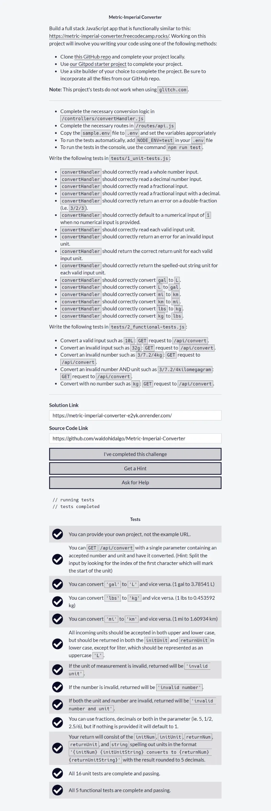

# Metric-Imperial Converter

[Primer proyecto](https://www.freecodecamp.org/learn/quality-assurance/quality-assurance-projects/metric-imperial-converter) de 5 proyectos en total los cuales son requisitos obligatorios para obtener la [Quality Assurance Certification](https://www.freecodecamp.org/learn/quality-assurance/#quality-assurance-projects) de freecodecamp.

El proyecto consiste en la realización de un convertidor de las siguientes unidades: **galones**, **libras** y **millas** a **litros**, **kilogramos** y **kilometros** respectivamente y viceversa. Lo anterior se realiza por medio de una ruta que recibe un query parameter llamado **input**. Además, se construye un sencillo front end que muestra la respuesta de la consulta a dicha ruta en la página misma. Por último, se construyen **16 tests unitarios** y **5 tests funcionales** los cuales todos se aprueban.

## Tabla de Contenido

- [Metric-Imperial Converter](#metric-imperial-converter)
  - [Tabla de Contenido](#tabla-de-contenido)
  - [Requisitos](#requisitos)
  - [Screenshots](#screenshots)
    - [1. Home Page](#1-home-page)
    - [2. API funcionando correctamente](#2-api-funcionando-correctamente)
    - [3. Conversión desde el Front End](#3-conversión-desde-el-front-end)
    - [4. Todos los Test unitarios y funcionales aprobados](#4-todos-los-test-unitarios-y-funcionales-aprobados)

## Requisitos

## Screenshots

### 1. Home Page

### 2. API funcionando correctamente

### 3. Conversión desde el Front End

### 4. Todos los Test unitarios y funcionales aprobados

